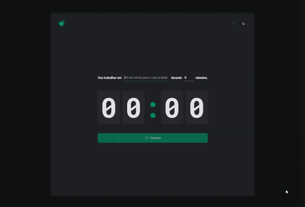

# Ignite Timer

  

 - Ignite Timer is a project created to sharpen my skills in React and TypeScript.
 - It utilizes libraries such as Styled Components, React Hook Form, Zod, and HookForm/Resolver to develop a Pomodoro application.
 - This application allows users to create timers for task execution and track their task history.
